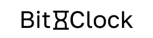

<div align="center">
    
    <h1>Bit:Clock</h1>
</div>

Bit:Clock is a ledger-free distributed timestamp system.
> [!NOTE]
> Bit:Clock is currently in active development.
## Set up
### 1. install
```
git clone https://github.com/kotagit75/Bit-Clock.git
```
or
Download ZIP
### 2. install packages
```
npm install
```
## Usage
**run**
```bash
npm start
```
**proof**
```bash
curl -X POST -H "Content-Type: application/json" -d '{"data":"Some data"}' localhost:8080/proof
```
**get pool**
```bash
curl http://localhost:8080/getPool
```
**get address**
```bash
curl http://localhost:8080/address
```
**get status**
```bash
curl http://localhost:8080/status
```
## License
MIT License